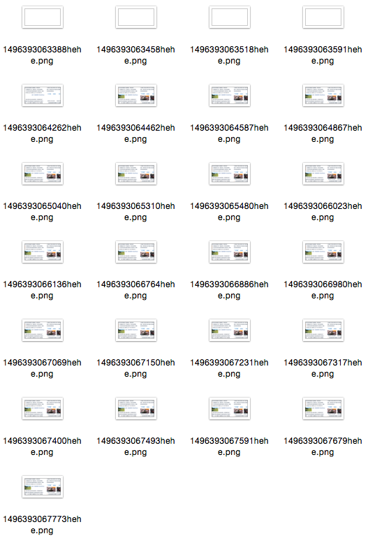

# K-Reptile

NodeJS Reptile Tools

## USE

### check page load time 

phantomjs ./Src/Phantomjs/report.js http://qq.com

```shell
~/Learning/apache_sites/K-Reptile   master ✘ ✹  phantomjs ./Src/Phantomjs/report.js http://qq.com
Listener_Page page.onResourceError{"0":{"errorCode":203,"errorString":"Error downloading http://wa.gtimg.com//wa.gtimg.com/website/201705/yqdzxsy_ACW_20170519145353989.swf - server replied: Not Found","id":252,"status":404,"statusText":"Not Found","url":"http://wa.gtimg.com//wa.gtimg.com/website/201705/yqdzxsy_ACW_20170519145353989.swf"}}
Loading time 4741 msec
白屏完成时间1067
dom_complete完成时间1231
首屏完成时间1067
window.onload完成时间4371
资源总数: 261
资源总大小: 4695338
```

save loading page screenshot



